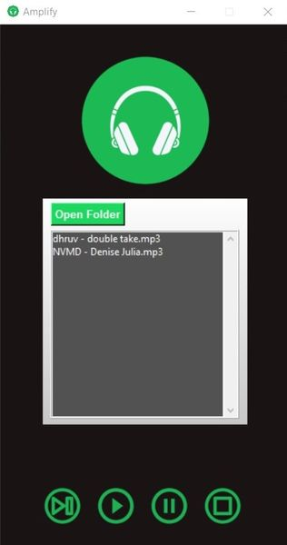

 # Amplify Music Player
 -------------
 

 

## Description
Amplify Music Player is a python music player thats acts as a 
repository for your songs and allows the user to play it . 

The user must choose a specific folder that holds the music in order to add them to the Amplify Music Player.
You can choose a song from the list that has been added and play, pause, resume, and stop songs by using the 
various buttons that are coded into the program. This is made possible by the import pygame.

To get started with Amplify, begin by reading the How to Setup section.

## Table of contents
* Introduction
* How to Setup?
  * Installing Libraries
  * Importing Modules
* How to Use?
  * Requirements
  * Execution

## Introduction

Various music player apps have been created as a result of technological advancements. 
These apps offer a wide range of features and functionalities. 
Some apps, however, charge a monthly subscription fee to remove advertisements.
But Python makes it possible for us to create a functional music player for free.
So, in this project, we'll utilize its tools to build an MP3 player.

## How to Setup

We must first get all the prerequisites ready in order for this project to succeed.

  * Install ***Python 3.11.0*** for **pip**,  **tcl/tk**, and **IDLE**  
  * Copy the installation directory. e.g. `C:\Python\Python311`  
  * Add the directory in ***PATH*** environent variable.  

### Installing Libraries

Check to see if Python and a code editor are both installed on your computer.  
To determine whether Python is installed, use the command listed below.   
`python --version`  
Regardless of the OS you are using, this command will function.

The pygame library needs to be installed as well. To execute the installation command, we'll use PIP.  
`pip install pygame`  

By using the command below, Pillow library is used for resizing the image input to the program.  
`pip install Pillow`  

### Importing Modules 

The modules that we have installed must be imported before we can utilize them,
specifically a few packages that are compatible with our project.
The following code will allow us to utilize the modules.  

#importing libraries  
from PIL import ImageTk, Image  
from tkinter import *  
from tkinter import Tk  
from tkinter import filedialog  
from pygame import mixer  
import os  

## How to Use
### Requirements
 * After installing required libraries, clone the repository.  
`git clone https://github.com/jeronscc/ACP-Final-Project.git`  
 * You need to have designated folder where .mp3 files are located.
 
### Execution
1. Run the `main.py`.
2. Click the Select Folder icon.
3. Go to the desired directory where ***.mp3*** files are located.
4. The player contains four main buttons: Play, Pause, Stop, Repeat.  
Its functions depend on what the user desires with the application.
5. To play a song, the user must choose among the songs listed in the directory.  
A scroll bar was also provided for the user to freely roam the application.

### Video Presentation
<a href="https://youtu.be/rbIcJPyioN4
" target="_blank"></iframe> width="240" height="180" border="10" /></a>

  
